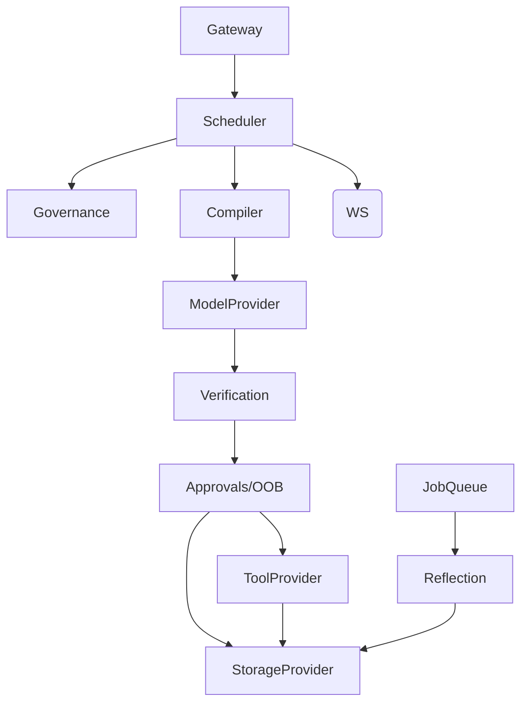

# Adesh OS Implementation Plan

## Inputs and Target Stack
This implementation plan is derived from the reading order established in `index.md`, encompassing the core Execution Physics, Persistence & Concurrency, and API batch contracts.
**Target Stack:** Rust, Tokio, Axum, with a pluggable provider architecture; SQLite is implemented first as a reference `StorageProvider` backend without baking SQLite assumptions into kernel contracts, as defined in `stack.md`. We enforce strict fail-closed behavior on all audit-critical paths.

## A) Spec Digestion Summary

**System in your words:**
Adesh OS is a deterministic, governed agent operating system that enforces strict isolation and policy-based gating on all LLM reasoning and interactions. Instead of allowing an LLM to directly execute actions, the OS decomposes requests into isolated working memory blocks (operations), compiles memory securely using a JIT compiler to prevent taint laundering, and forces the model to output structured syscall intents.
These syscalls are then rigorously verified against a statically defined capability registry and audience graph, with high-risk actions parked for explicit user approval or Out-Of-Band (OOB) authorization before execution. The entire lifecycle is backed by an append-only experience log and immutable audit traces.

**Core Invariants:**
- **Control Plane Root Owner Only:** HTTP/WS control plane actions strictly require a Root Owner session.
- **Side effects = Syscalls:** All side effects must occur exclusively via persisted `SyscallEnvelope` records.
- **max(R,S) Governance:** Every syscall and operation is gated by `max_gate = max(Action Risk R, Data Sensitivity S)`.
- **Default Deny for Audiences:** All unknown audience nodes, edges, or scopes result in a default deny.
- **Operation Isolation & Explicit IPC:** Strict isolation between operations; cross-operation data transfer requires explicit `IPCArtifacts`.
- **Taint-Aware Memory:** Memory blocks carry taint, preventing taint laundering into lower-sensitivity outputs without explicit sanitization.
- **Audit Never Fails Open:** Missing audit anchors or storage failures result in a hard failure (fail closed).
- **Single-Use OOB Authorization:** OOB challenges must be bound to a specific approval and consumed exactly once.
- **Pinned Pointers for Determinism:** Operations pin capability snapshots, active state, and audience graph versions to ensure replayability.

**Dependency Graph of Components:**

## B) Spec Gap Report
The following ambiguities, misplacements, and omissions block implementation and require immediate patching:

**SG-01: Missing control plane spec body**
- Location: `control_plane-apispec.md` (file is empty).
- Proposed Patch: Define canonical Authoritative Root Owner HTTP/WS endpoint contract in the file.

**SG-02: Operation decomposition/IPC spec is wrong file content**
- Location: `operation_decomposition_ipc.md` (content completely duplicates `approval_oob_spec.md`).
- Proposed Patch: Replace with "Operation Decomposition and Explicit IPC Spec v0.1" detailing decomposition triggers, fallback rules, and IPCArtifact inheritance.

**SG-03: Schema registry/versioning spec is wrong file content**
- Location: `schema_registry_and_versioning.md` (duplicates `data_classification_and_taint_labelling.md`).
- Proposed Patch: Replace with "Schema Registry and Versioning Spec v0.1".

**SG-04: Retention file empty, retention spec misplaced**
- Location: `retention_and_data_lifecycle.md` is empty. `threat_mode.spec.md` instead contains the retention text.
- Proposed Patch: Move the retention text to the right file, and populate `threat_mode.spec.md` with actual threat analysis.

**SG-05: Approval endpoint path ambiguity**
- Location: `approval_oob_spec.md` vs `kernel_execution_loop.md` paths use `{operation_id}` while the model supports 1..N `approval_id`.
- Proposed Patch: Canonicalize to `POST /v1/approvals/{approval_id}`.

**SG-06: Storage schema missing core functional tables**
- Location: `storage_schema.md` vs backend contracts.
- Proposed Patch: Add logical tables for `idempotency_keys`, `operation_leases`, `approval_items`, and `oob_challenges`.

**SG-07: OperationSpec pinning fields inconsistent with invariants**
- Location: `api_batch_1.md` `OperationSpec.pinned_state` requires only active state and capability snapshot, missing audience graph.
- Proposed Patch: Add `audience_graph_version` to pinned state requirements.

**SG-08: GateDecision pinning field too narrow**
- Location: `api_batch_2.md` `GateDecision.pinned_state_version` is a single string.
- Proposed Patch: Expand to an object containing active state, capability, and audience graph versions for deterministic replay.

**SG-09: OOB session semantics conflict risk**
- Location: `api_batch_1.md` `OwnerSession.auth_level = oob_verified`.
- Proposed Patch: Clarify that OOB is never session elevation. It is single-use and consumed atomically during approval.

**SG-10: KRI spec filename mismatch**
- Location: `observability_audit.md` / `test_and_kri.md` cross-reference alignment.
- Proposed Patch: Update reference to the existing `test_and_kri.md`.

## C) Database + Storage Mapping

### C1. Method to Schema Mapping
- `append_event` -> `experience_events`
- `put_idempotent_response` -> `idempotency_keys` *(from gap patch)*
- `create_operation_bundle` -> `operations`, `operation_transitions`, `audit_traces`
- `try_acquire_operation_lease` -> `operations` (using new lease columns) or `operation_leases` *(from gap patch)*
- `put_gate_decision` -> `gate_decisions`
- `put_compiled_slice` -> `compiled_slices`
- `put_syscall_envelope` / `update_syscall_status` / `put_syscall_deny` -> `syscalls`, `syscall_denies`, `syscall_status_transitions`
- `create_approval_item` / `consume_approval_atomic` -> `approval_items`, `oob_challenges` *(from gap patch)*, `syscalls`, `operation_transitions`
- `put_audit_trace` / `append_audit_timeline_item` -> `audit_traces`

### C2. Required tables/indices by critical concern
#### Idempotency keys
- **Required table:** `idempotency_keys`
- **Columns:** `endpoint_scope`, `idempotency_key`, `request_id`, `response_json`, `response_hash`, `created_at`, `expires_at`
- **Indices:** `UNIQUE(endpoint_scope, idempotency_key)`, `INDEX(expires_at)`

#### Operation leases
- **Required table:** `operation_leases`
- **Columns:** `operation_id PK`, `lease_owner`, `leased_until`, `lease_epoch`, `last_heartbeat_at`, `updated_at`
- **Indices:** `INDEX(leased_until)`, `INDEX(lease_owner, leased_until)`

#### Approvals + OOB (single-use)
- **Required tables:** `approval_items`, `approval_item_syscalls`, `oob_challenges`
- **Columns:** 
  - `approval_items`: `approval_id`, `operation_id`, `status`, `approval_mode`, `proposal_bundle_json`, `diff_payload_json`, `prompt`, `expires_at`, `audit_trace_id`
  - `oob_challenges`: `challenge_id`, `approval_id`, `nonce_hash`, `status`, `issued_at`, `verified_at`, `consumed_at`, `expires_at`, `attempts`
- **Indices:** `approval_items(operation_id, status)`, `oob_challenges(approval_id, status, expires_at)`, `UNIQUE(challenge_id)`

#### Syscall pre-image and status transitions
- **Required tables:** existing `syscalls`, `syscall_denies`; add `syscall_status_transitions`
- **Indices:** `idx_syscalls_op_time`, `idx_syscalls_status`, `syscall_status_transitions(syscall_id, ts)`

### C3. Atomic Units Implementation Requirements (from storage_semantics_txn.md)
- **T1: Request acceptance:** Begin DB TX -> Insert `experience_events`, `operations`, `operation_transitions`, `audit_traces`, `idempotency_keys` -> Commit.
- **T2: GateDecision persistence:** Begin DB TX -> Insert `gate_decisions`, append timeline to `audit_traces` -> Commit.
- **T3: CompiledSlice persistence:** Begin DB TX -> Insert `compiled_slices`, update `operations.state` = 'compiled', append `operation_transitions` and `audit_traces` -> Commit.
- **T4: Approval consumption:** Begin DB TX -> Lock approval row, validate/consume OOB, update `approval_items`, append `experience_events`, update `syscalls` (permitted), update `operations.state` = 'running', append `audit_traces` -> Commit.
- **T5: Syscall execution record update:** Begin DB TX -> Insert tool result into `experience_events`/`blob_objects`, update `syscalls` (executed/failed), append `audit_traces` -> Commit.
- **T6: Syscall denial:** Begin DB TX -> Insert `syscall_denies`, update `syscalls` (denied), append `audit_traces` -> Commit.

## D) Vertical Slice Milestones & Test Plan

**Milestone 1: Kernel skeleton (no real tools, stub model)**
*Acceptance Criteria:*
- Rust workspace initialized (`adesh-core`, `adesh-contracts`, `adesh-storage-sqlite`, `adesh-daemon`).
- HTTP (`POST /v1/requests`) and WS framework running (Axum, localhost binding only).
- Root Owner authorization enforced on HTTP.
- Operation lifecycle initialized (T1 atomic execution).
- Storage DB schema wired (SQLite) with idempotency implementation (`idempotency_keys`).
- Basic operation leasing is functional.
*Required Tests:*
- Unit: `idempotency_store_returns_identical_response_for_same_key`, `operation_lease_compare_and_set_exclusive`, `request_txn_rolls_back_when_audit_write_fails`
- Integration: `post_requests_idempotent_no_duplicate_operation`, `two_runners_one_operation_only_one_lease`, `ws_events_emitted_only_after_persisted_transition`

**Milestone 2: Governance + Compiler + Verification loop (stub model output)**
*Acceptance Criteria:*
- Implement R/S/max_gate logic (`governanace_kernal_logic.md`).
- Implement JIT Compiler (`JIT_compiler.md`) enforcing strict block packing bounds.
- Implement Verification Core parsing stub model output, checking schemas, drift, and taint laundering.
- Persist `GateDecision` and `CompiledSlice` using T2 & T3 atomic blocks.
- WS emits phase state updates.
*Required Tests:*
- Unit: `gate_computation_uses_max_r_s`, `verification_unknown_audience_default_deny`, `verification_taint_laundering_deny_requires_sanitize`, `anti_retry_returns_same_deny_then_blocks`
- Integration: `operation_persists_gate_and_compiled_slice_before_running`, `awaiting_approval_state_persisted_before_ws_approval_required`

**Milestone 3: Approvals + OOB atomic consumption**
*Acceptance Criteria:*
- Pending syscall proposals generate `ApprovalItems` appropriately (confirm/diff).
- Implement `POST /v1/approvals/...` endpoints and OOB challenge lifecycle integration.
- Implement strictly atomic T4 approval consumption (`storage_semantics_txn.md`).
- Verified syscalls are transitioned to `permitted` but NOT executed.
*Required Tests:*
- Unit: `oob_challenge_single_use_atomic_consume`, `approval_modified_payload_regates_and_escalates`, `approval_idempotency_no_double_consume`
- Integration: `approval_flow_toc_tou_prevented`, `stale_or_superseded_approval_returns_conflict`, `consume_approval_atomic_persists_permitted_syscalls_without_execution`

**Milestone 4: Tool execution + replay + reflection (minimum)**
*Acceptance Criteria:*
- ToolProvider framework stub handles a fake actuator/sensor based on `capability_mcp.md`.
- T5 atomic block persists pre-image of the `SyscallEnvelope` before execution, and the result/error afterward.
- Reflection Background Job Queue (`jobs` table) wired to mint new active state versions safely.
- Full `/v1/audit/{id}/replay` API works in `dry_run` mode using the anchors.
*Required Tests:*
- Unit: `tool_execution_rejects_missing_syscall_preimage`, `replay_dry_run_never_executes_actuator`, `reflection_mints_new_version_not_mutate_pinned`
- Integration: `syscall_preimage_then_execution_result_persist_order`, `replay_missing_anchor_fail_closed`, `reflection_review_items_created_no_auto_dangerous_write`

## E) Next Steps: First PR-Sized Code Change

**Target Flow:** Milestone 1 Kernel Skeleton

**Planned Files for Creation/Modification:**
1. `/home/rajan/Desktop/work/aadesh/Cargo.toml` (workspace bootstrap)
2. `/home/rajan/Desktop/work/aadesh/crates/adesh-contracts/Cargo.toml`
3. `/home/rajan/Desktop/work/aadesh/crates/adesh-contracts/src/batch1.rs` (strict Batch-1 structs/validation)
4. `/home/rajan/Desktop/work/aadesh/crates/adesh-core/Cargo.toml`
5. `/home/rajan/Desktop/work/aadesh/crates/adesh-core/src/ports/storage.rs` (StorageProvider trait for M1)
6. `/home/rajan/Desktop/work/aadesh/crates/adesh-storage-sqlite/Cargo.toml`
7. `/home/rajan/Desktop/work/aadesh/crates/adesh-storage-sqlite/src/migrations/0001_init.sql` (M1 DDL incl. idempotency + operation leases + core tables)
8. `/home/rajan/Desktop/work/aadesh/crates/adesh-storage-sqlite/src/storage.rs` (request txn, idempotency, leases)
9. `/home/rajan/Desktop/work/aadesh/crates/adesh-daemon/Cargo.toml`
10. `/home/rajan/Desktop/work/aadesh/crates/adesh-daemon/src/main.rs` (bind `127.0.0.1`, boot wiring)
11. `/home/rajan/Desktop/work/aadesh/crates/adesh-daemon/src/http/routes.rs` (`POST /v1/requests`, `GET /v1/operations/{id}`, `GET /v1/health`)
12. `/home/rajan/Desktop/work/aadesh/crates/adesh-daemon/src/http/ws.rs` (`WS /v1/events`, storage-first emission)
13. `/home/rajan/Desktop/work/aadesh/tests/integration/request_idempotency.rs`
14. `/home/rajan/Desktop/work/aadesh/tests/integration/lease_exclusivity.rs`
15. `/home/rajan/Desktop/work/aadesh/tests/integration/audit_fail_closed.rs`
